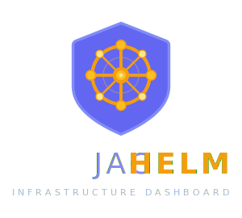

<p align="center">
  
</p>

<h1 align="center">JagHelm</h1>

<p align="center">
  <strong>Infrastructure Dashboard</strong><br>
  A real-time multi-node monitoring dashboard for homelabs.<br>
  Not just a link launcher — a live operations center for your self-hosted stack.
</p>

<p align="center">
  
  
  
  
  
</p>

---

## What Makes JagHelm Different

Homepage and Homarr are link launchers with widget sidecars. **JagHelm is a real-time multi-node infrastructure monitoring dashboard** that also happens to have service cards, bookmarks, and app integrations.

| Feature | Homepage | Homarr | JagHelm |
|---------|----------|--------|---------|
| Multi-node monitoring (CPU/RAM/Disk/Temp) | ❌ | ❌ | ✅ Per-node from Prometheus |
| Per-container resource stats (CPU/MEM/RX/TX) | ❌ | ❌ | ✅ Via cAdvisor |
| UPS power monitoring | Widget only | ❌ | ✅ Dedicated section via NUT |
| Uptime Kuma deep integration | Widget only | Widget only | ✅ Per-service health, ping, uptime bars |
| Three-tier service cards | ❌ | ❌ | ✅ Health → Container stats → App API |
| Embedded service tabs | ❌ | ❌ | ✅ Uptime Kuma, Grafana, etc. as native tabs |
| Content-aware grid layout | ❌ | ✅ | ✅ HelmGrid — panels auto-fit content |
| Drag service cards between panels | ❌ | ❌ | ✅ Custom groups with drag-and-drop |
| UI-first configuration | ❌ (YAML only) | ✅ | ✅ Full settings page + YAML escape hatch |
| Server-side config persistence | ❌ | ✅ | ✅ Survives container rebuilds |
| Built-in authentication | ❌ | ✅ | ✅ With password change from UI |
| Encrypted secrets management | ❌ | ✅ | ✅ AES-256-GCM |
| VS Code-inspired themes | ❌ | ❌ | ✅ 10 themes (6 dark + 4 light) |
| PWA / installable on mobile | ❌ | ❌ | ✅ Add to home screen, full-screen app |

---

## Features

### 🖥 Multi-Node Infrastructure Monitoring
Real-time metrics from Prometheus for every node in your homelab. CPU, RAM, disk usage, temperature, and uptime — all at a glance. Nodes are auto-discovered from Prometheus labels on first boot.

### 📦 Per-Container Resource Stats
CPU, memory, network RX/TX for every Docker container via cAdvisor. See exactly which containers are consuming resources across all your nodes.

### 🔗 Embedded Service Tabs — Your Tools, One Dashboard
JagHelm embeds your existing monitoring tools as native tabs in the navigation bar. Uptime Kuma, Grafana, Portainer — they render inside JagHelm's UI as seamless iframe views, not external links that open new windows.

**How it works:** Go to Settings > Tabs, add a new tab with the URL of any web-based service in your homelab. It appears in the top navigation alongside the Dashboard tab. Click it and the service loads inline — same window, same session, same dashboard. Click Dashboard to come back. It feels like one integrated application.

**Why this matters:** Other dashboards open your tools in new browser tabs. You end up with 8 tabs competing for attention. JagHelm keeps everything in one place — your monitoring dashboard, your Uptime Kuma status page, your Grafana panels, all accessible without leaving the JagHelm window.

**Works great with:**
- **Uptime Kuma** — status page and monitor management
- **Grafana** — detailed metric dashboards and alerting
- **Portainer/Dockge** — container management
- **Proxmox** — hypervisor management
- Any web UI accessible on your network

### ⚡ UPS Power Monitoring
Dedicated UPS section showing battery status, charge level, runtime, and load via NUT/Prometheus. Automated graceful shutdown support.

### 🟢 Uptime Kuma Deep Integration
Every service card shows live health status, ping latency, and 24-hour uptime percentage directly from Uptime Kuma. Auto-matched to containers or manually mapped.

### 📊 Three-Tier Service Cards
- **Tier 1 — Health:** Status dot + ping + running/down badge from Uptime Kuma
- **Tier 2 — Container Stats:** CPU, MEM, RX, TX per container from cAdvisor
- **Tier 3 — App API Data:** Integration-specific metrics (queries blocked, hosts proxied, etc.)

Service card detail level is configurable: minimal, stats, or full. Drag service cards between node panels and custom groups to organize your view.

### 📐 HelmGrid — Custom Layout Engine
JagHelm uses **HelmGrid**, a purpose-built grid layout engine designed specifically for infrastructure dashboards.

- **Content-aware panels** — panels automatically grow to fit their content. No clipping, no scrollbars. You can make panels taller but never shorter than their content.
- **Snap-to-grid** drag and resize with visual placeholders
- **Auto-fit on drop** — drag a full-width panel to a half-width spot and it shrinks to fit
- **SE/SW resize handles** with hover indicators
- **Column slider** (6–24 columns) — panels automatically reposition and resize when you change the grid density
- **No overlap** — panels push each other down, never stack on top

HelmGrid was built from scratch to replace react-grid-layout after encountering persistent resize bugs in RGL's internal layout calculation. Every line is purpose-written for JagHelm's use case — no black-box abstractions, no unexpected behaviors.

### 🎨 10 VS Code-Inspired Themes
Choose from the most popular developer themes, adapted for dashboard use:

| Theme | Type | Description |
|-------|------|-------------|
| **One Dark Pro** | Dark | Atom's iconic dark theme (default) |
| **Dracula** | Dark | Vibrant purple accents |
| **Night Owl** | Dark | Deep blue, optimized for low-light |
| **GitHub Dark** | Dark | Clean and minimal |
| **Catppuccin Mocha** | Dark | Warm, soothing pastels |
| **Material Ocean** | Dark | Google Material's darkest variant |
| **GitHub Light** | Light | Clean white, corporate feel |
| **Catppuccin Latte** | Light | Warm cream, pastel accents |
| **Solarized Light** | Light | Iconic warm ivory with teal |
| **Atom One Light** | Light | Crisp white, bold red accent |

### 🔤 Full Typography System
- **5 font family presets:** Default (Outfit), Clean (Inter), Rounded (Nunito), Sharp (Rajdhani), System
- **8 targeted font size controls:** Section headers, metric values, metric labels, service names, stat values, stat labels — each independently adjustable
- Contrast-optimized defaults for readability on dark backgrounds

### ⚙️ Full-Page Settings UI
Professional settings experience — no cramped drawers. Full-page layout with sidebar navigation across 13 sections:

- **General** — Title, subtitle, logo upload/restore
- **Appearance** — Theme picker, accent color, background image, opacity
- **Typography** — Font family presets, per-element size sliders
- **Layout** — Grid columns (6–24), refresh interval, card detail level
- **Sections** — Per-section visibility, colors, titles for UPS/Pipeline/Quick Launch/Todos
- **Nodes** — Per-node display name, subtitle, icon, border color, auto-discover, hide list
- **Services** — Per-container display name, icon, Kuma monitor dropdown, visibility
- **Integrations** — Preset gallery (42 apps) + custom integration builder with test-before-save
- **Links** — Full CRUD for Quick Launch bookmarks with drag reordering
- **Widgets** — Search engine, weather, feature toggles
- **Tabs** — Iframe tab management (embed Grafana, Kuma, etc.)
- **Security** — Password change from UI (scrypt hashed, persisted server-side)
- **Backup** — Export/import config JSON

Settings includes a live preview panel — see your changes take effect in real time without switching back to the dashboard.

### 🔐 Security
- Optional password authentication with **scrypt hashing** (Node.js built-in, timing-safe comparison)
- Password changeable from the Settings UI (no SSH required)
- **Login rate limiting** — 5 attempts per IP per 15 minutes to prevent brute-force attacks
- AES-256-GCM encrypted secrets for API credentials (PBKDF2 key derivation, 100k iterations)
- Session management with 24-hour expiry and automatic cleanup
- **Logout from the UI** — session cleared from browser and server
- **File upload validation** — MIME type whitelist (images only)
- All API requests proxied through the backend — no credentials exposed to the browser
- Frontend fetch timeouts prevent UI hangs when backend services are down

### 🚀 Quick Launch
Organized bookmark groups with proper service icons (auto-matched from 35+ self-hosted app icons). Full CRUD — add, edit, delete, reorder links and groups from the Settings UI.

### 🔄 Real-Time Updates
Configurable refresh interval (10s–120s). All data sources refresh in parallel. Server-side caching with proper cache busting. Live health indicator in the navigation bar.

### 💾 Server-Side Config Persistence
All display settings (theme, layout, sections, links, etc.) save to `data/display-config.json` server-side with 2-second debounced writes. Survives container rebuilds via Docker volume. Infrastructure config (nodes, services, integrations) stored in `data/services.yaml` with hot-reload on file change.

---

## Quick Start

> **New to JagHelm?** Check out the [Getting Started Guide](https://git.jagbhandal.com/jagdeep.bhandal/JagHelm/wiki/Getting-Started-Guide) for a complete walkthrough — from installing Prometheus to a fully configured dashboard.

### Docker Compose (Recommended)

```yaml
services:
  jaghelm:
    build: .
    container_name: jaghelm
    restart: unless-stopped
    ports:
      - 3099:3099
    environment:
      PROMETHEUS_URL: http://your-prometheus-host:9090
      KUMA_URL: http://your-kuma-host:3001
      DASH_SECRET: your-random-secret-here  # openssl rand -hex 32
      DASH_USER: admin
      DASH_PASS: your-password
    volumes:
      - ./data:/app/data        # Config + secrets persist here
      - ./uploads:/app/uploads  # Logo + background images
```

```bash
docker compose up -d
```

Open `http://your-server:3099` — JagHelm will auto-discover your Prometheus nodes and start monitoring immediately.

### Requirements

- **Prometheus** with node_exporter on each node you want to monitor
- **cAdvisor** on each node for container-level stats
- **Uptime Kuma** (optional) for service health monitoring
- **NUT exporter** (optional) for UPS monitoring

---

## Configuration

### Zero-Config by Default

JagHelm auto-discovers nodes and containers from Prometheus on first boot. No YAML editing required. Everything is configurable from the Settings UI.

### Power-User Escape Hatch

For those who prefer files over UI, all config is stored in standard YAML/JSON:

```
data/
├── services.yaml          # Nodes, services, integrations (server config)
├── display-config.json    # Theme, layout, sections, links (UI config)
├── secrets.json           # Encrypted API credentials
├── auth.json              # Password hash (if changed via UI)
└── todos.json             # Checklist data
```

### Environment Variables

```env
# Required
PROMETHEUS_URL=http://your-prometheus:9090
KUMA_URL=http://your-kuma:3001

# Required for encrypted secrets
DASH_SECRET=your-random-secret-here

# Optional authentication
DASH_USER=admin
DASH_PASS=your-password
PORT=3099

# Optional integration overrides (these take priority over UI-managed config)
ADGUARD_URL=http://your-adguard-host:8085
ADGUARD_USER=admin
ADGUARD_PASS=secret
GITEA_URL=http://your-gitea:3001
GITEA_TOKEN=your-token
NPM_URL=http://your-npm-host:81
NPM_USER=admin@example.com
NPM_PASS=secret
```

---

## Architecture

```
┌─────────────────────────────────────────────────────┐
│                  Full-Page Settings UI               │
│  General │ Appearance │ Typography │ Layout │ ...    │
└────────────────────────┬────────────────────────────┘
                         │ reads/writes via API
┌────────────────────────▼────────────────────────────┐
│                   Express Server                     │
│                                                      │
│  ┌──────────┐  ┌───────────┐  ┌──────────────────┐  │
│  │ Config   │  │ Discovery │  │ Integration      │  │
│  │ Manager  │  │ Engine    │  │ Engine           │  │
│  │          │  │           │  │                  │  │
│  │services. │  │Prometheus │  │42 presets +      │  │
│  │yaml      │  │cAdvisor   │  │custom configs    │  │
│  │(r/w)     │  │Docker     │  │Calls APIs with   │  │
│  │          │  │Kuma       │  │encrypted creds   │  │
│  └──────────┘  └───────────┘  └──────────────────┘  │
│                                                      │
│  ┌──────────────────────────────────────────────┐    │
│  │              Secrets Manager                  │    │
│  │  AES-256-GCM with DASH_SECRET                │    │
│  └──────────────────────────────────────────────┘    │
└──────────────────────────────────────────────────────┘
         │              │              │
   ┌──────────┐  ┌───────────┐  ┌──────────┐
   │Prometheus│  │Uptime Kuma│  │App APIs  │
   │  +nodes  │  │ monitors  │  │AdGuard   │
   │  +cAdv.  │  │           │  │NPM, etc. │
   │  +NUT    │  │           │  │          │
   └──────────┘  └───────────┘  └──────────┘
```

### Tech Stack

- **Frontend:** React 19, Vite 8 (Rolldown), HelmGrid (custom layout engine), @dnd-kit, react-colorful
- **Backend:** Express.js, js-yaml
- **Monitoring:** Prometheus, cAdvisor, node_exporter, NUT exporter
- **Health:** Uptime Kuma API integration
- **Security:** AES-256-GCM (PBKDF2 key derivation), scrypt password hashing
- **Icons:** Dashboard Icons (walkxcode) + selfh.st — 2,000+ self-hosted app SVGs

---

## Roadmap

### ✅ Phase 1: Foundation (Complete)
Config manager, secrets manager, discovery engine, monitor matching, unified `/api/services`.

### ✅ Phase 2: Settings UI (Complete)
Full-page settings with sidebar navigation. Nodes tab, Services tab, Links CRUD, Security tab, Typography system. Server-side display config persistence.

### ✅ Phase 3: Integration Engine (Complete)
42 declarative integration presets for common self-hosted apps. Custom integration builder. Test-before-save for connections. Encrypted credential storage.

### 🔧 Phase 4: Polish (In Progress)
HelmGrid custom layout engine, security hardening (scrypt, fetch timeouts), content-aware panel sizing, node-scoped service card UIDs, auto-fit on drop, column clamping. Next: Docker label discovery, responsive mobile layout, open-source preparation.

---

## Acknowledgments & Credits

JagHelm stands on the shoulders of outstanding open-source projects, icon collections, and infrastructure tools. We believe in giving credit where it's due.

### Core Dependencies

| Package | Author(s) | Used For | License |
|---------|-----------|----------|---------|
| [React](https://react.dev) | Meta / Facebook | UI framework | MIT |
| [Vite](https://vitejs.dev) | Evan You & contributors | Build tool & dev server | MIT |
| [Express](https://expressjs.com) | TJ Holowaychuk & community | API server | MIT |
| [@dnd-kit](https://dndkit.com) | Claudéric Demers | Service card drag-and-drop | MIT |
| [react-colorful](https://github.com/omgovich/react-colorful) | Vlad Shilov | Color picker in settings | MIT |
| [js-yaml](https://github.com/nodeca/js-yaml) | Nodeca | YAML config parsing | MIT |
| [multer](https://github.com/expressjs/multer) | Express community | File upload handling | MIT |
| [dotenv](https://github.com/motdotla/dotenv) | Scott Motte | Environment variable management | BSD-2-Clause |
| [concurrently](https://github.com/open-cli-tools/concurrently) | Kimmo Brunfeldt | Parallel dev server startup | MIT |

### Icon Collections

JagHelm's searchable icon picker draws from three outstanding community-maintained collections:

| Collection | Maintainers | Icons | Used For |
|------------|-------------|-------|----------|
| [Dashboard Icons](https://github.com/homarr-labs/dashboard-icons) | Homarr Labs team & contributors | 1,800+ | Service icons, section icons, Quick Launch icons |
| [selfh.st Icons](https://github.com/selfhst/icons) | Ethan Sholly (selfh.st) | 200+ | Additional self-hosted app icons |
| [Simple Icons](https://github.com/simple-icons/simple-icons) | Simple Icons contributors | 2,500+ | Brand and technology icons |

Icons are served via [jsDelivr CDN](https://www.jsdelivr.com) — thank you to jsDelivr for providing free, fast, and reliable open-source CDN infrastructure.

### Infrastructure Integrations

JagHelm integrates with these services for data collection and monitoring:

| Service | Used For |
|---------|----------|
| [Prometheus](https://prometheus.io) | Node metrics (CPU, RAM, disk, temperature, uptime) |
| [cAdvisor](https://github.com/google/cadvisor) (Google) | Per-container resource stats (CPU, MEM, network) |
| [Uptime Kuma](https://github.com/louislam/uptime-kuma) by Louis Lam | Service health monitoring, ping latency, uptime tracking |
| [NUT (Network UPS Tools)](https://github.com/networkupstools/nut) | UPS battery monitoring via Prometheus exporter |
| [Gitea](https://github.com/go-gitea/gitea) | Pipeline activity feed and CI/CD integration |
| [Open-Meteo](https://open-meteo.com) | Weather data API (free, no API key required) |

### Design Inspiration

| Project | What We Learned |
|---------|-----------------|
| [Homepage](https://gethomepage.dev) by Ben Phelps & contributors | Layout settings architecture, nested group concept, settings structure |
| [Homarr](https://homarr.dev) by Homarr Labs | Searchable icon picker from multiple repositories, integration preset patterns |
| [VS Code](https://code.visualstudio.com) by Microsoft | Theme color palettes — our 10 themes are inspired by popular VS Code themes |

The VS Code-inspired theme palettes draw from color schemes by these creators:

| Theme | Original Creator | Repository |
|-------|-----------------|------------|
| One Dark Pro | Binaryify | [GitHub](https://github.com/Binaryify/OneDark-Pro) |
| Dracula | Zeno Rocha | [GitHub](https://github.com/dracula/dracula-theme) |
| Night Owl | Sarah Drasner | [GitHub](https://github.com/sdras/night-owl-vscode-theme) |
| GitHub Dark / Light | Primer team (GitHub) | [GitHub](https://github.com/primer/github-vscode-theme) |
| Catppuccin Mocha / Latte | Catppuccin community | [GitHub](https://github.com/catppuccin/catppuccin) |
| Material Ocean | Mattia Astorino (Equinusocio) | [GitHub](https://github.com/equinusocio/vsc-material-theme) |
| Solarized Light | Ethan Schoonover | [GitHub](https://github.com/altercation/solarized) |
| Atom One Light | Atom community | [GitHub](https://github.com/atom/atom) |

### Fonts

Typography is provided by [Google Fonts](https://fonts.google.com):

| Font | Designer | Used For |
|------|----------|----------|
| [Outfit](https://fonts.google.com/specimen/Outfit) | Rodrigo Fuenzalida | Display headings (default) |
| [DM Sans](https://fonts.google.com/specimen/DM+Sans) | Colophon Foundry | Body text (default) |
| [JetBrains Mono](https://github.com/JetBrains/JetBrainsMono) | JetBrains | Monospace / code (default) |
| [Inter](https://github.com/rsms/inter) | Rasmus Andersson | Clean preset |
| [Fira Code](https://github.com/tonsky/FiraCode) | Nikita Prokopov | Clean preset monospace |
| [Nunito](https://fonts.google.com/specimen/Nunito) | Vernon Adams | Rounded preset |
| [Source Code Pro](https://github.com/adobe-fonts/source-code-pro) | Adobe | Rounded preset monospace |
| [Rajdhani](https://fonts.google.com/specimen/Rajdhani) | Indian Type Foundry | Sharp preset |
| [Roboto](https://fonts.google.com/specimen/Roboto) | Christian Robertson (Google) | Sharp preset body |
| [Roboto Mono](https://fonts.google.com/specimen/Roboto+Mono) | Christian Robertson (Google) | Sharp preset monospace |

### Security

JagHelm uses Node.js built-in `crypto` module for all cryptography — scrypt password hashing, AES-256-GCM secrets encryption, and cryptographically secure random token generation. No external cryptography libraries are used.

### Development

JagHelm was developed with assistance from **Claude AI** by [Anthropic](https://anthropic.com). Claude contributed to architecture design, code generation, debugging, and documentation across all development phases.

### Community

Thank you to the self-hosted and homelab community — especially the communities around [r/selfhosted](https://reddit.com/r/selfhosted) and [r/homelab](https://reddit.com/r/homelab) — for building and maintaining the incredible ecosystem of tools that JagHelm monitors and integrates with.

---

## License

MIT License. See [LICENSE](LICENSE) for details.

---

<p align="center">
  <sub>Built with ☕ and late nights for the self-hosted community.</sub><br>
  <sub>Developed with assistance from <a href="https://anthropic.com">Claude AI</a> by Anthropic.</sub>
</p>
