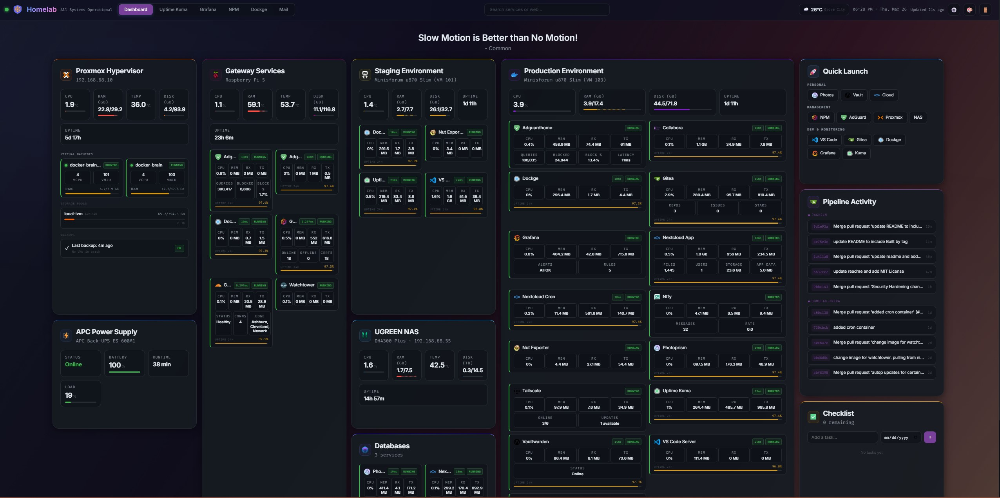

<p align="center">
  
</p>
<h1 align="center">JagHelm</h1>
 
<p align="center">
  <b>Live data, not just links.</b><br>
  A self-hosted homelab dashboard that reads real Prometheus &amp; cAdvisor metrics,
  service health, and<br>42 app integrations that call your services — behind a layout you drag and resize yourself.
</p>
<p align="center">
  
  
  
  
  
</p>
<p align="center">
  
</p>

## Why JagHelm

Most self-hosted dashboards are **link launchers** — a grid of bookmarks with a
status dot. JagHelm starts from the other end: it pulls **live numbers** off your
existing monitoring stack and the apps themselves, then lets you arrange that
data however you like.

- **Real metrics, not pings.** CPU, RAM, disk, temperature and uptime per node
  come straight from Prometheus + node_exporter; per-container CPU/MEM/network
  comes from cAdvisor. These are the same time-series your Grafana reads — not a
  reachability check.
- **42 integrations that call your services.** AdGuard queries blocked, Sonarr
  queue, Proxmox node load, NPM proxy count, and 38 more — each preset knows the
  endpoint, auth shape, and formatting, so a card shows the actual number, not a
  link to go find it.
- **A grid you actually arrange.** A custom drag-resize layout engine (HelmGrid)
  — panels snap, auto-grow to fit content, and push each other on overlap.

### JagHelm vs Homepage vs Dashy

A rough comparison of where JagHelm sits. Homepage and Dashy are excellent, more
mature projects with bigger communities — if JagHelm doesn't fit, one of them
probably will. The point of this table is *positioning*, not a scoreboard.

| | **JagHelm** | **Homepage** | **Dashy** |
|---|---|---|---|
| Primary model | Live infra **metrics** + integrations | Links + widgets | Links + status |
| Node metrics (CPU/RAM/disk/temp) | ✅ via Prometheus + node_exporter | Partial (widgets) | ❌ |
| Per-container stats (cAdvisor) | ✅ | ❌ | ❌ |
| App integrations | 42 presets + custom builder | Many widgets | Status checks + some widgets |
| Layout | Drag-resize grid (snap/auto-grow) | Config-defined columns | Config-defined sections |
| Config | UI **and** YAML/JSON on disk | YAML files | YAML / UI editor |
| Auth | Single-user (built-in or proxy) | Proxy-oriented | Multiple options |
| Maturity | Single-maintainer hobby project | Large, mature | Large, mature |

JagHelm's trade-off is explicit: it leans on a **Prometheus** stack you already
run (a real dependency, see [`KNOWN-ISSUES.md`](KNOWN-ISSUES.md)) in exchange for
genuinely live data rather than bookmarks.

## What it is
 
JagHelm is a single-page dashboard you point at your homelab. It reads metrics from Prometheus, container stats from cAdvisor, and health checks from Uptime Kuma, then renders them as draggable cards in a layout you arrange yourself. Settings live in the UI — themes, layouts, integrations, secrets — backed by YAML on disk so nothing gets lost on a container rebuild.
 
It started as a personal project and is shared in the hope that other homelab folks will find it useful. The core flow: install once, point at your existing monitoring stack, drag panels around until you like them, walk away.
 
## What it isn't
 
- **Not a bookmark launcher.** There is a Quick Launch section, but the focus is live data, not links.
- **Not a monitoring backend.** Prometheus and Uptime Kuma do that work; JagHelm visualises what they collect.
- **Not multi-tenant.** Single-user authentication, single-user config. Designed for an individual homelab, not a team.
## Quick start
 
For a longer walkthrough — including standing up Prometheus and cAdvisor if you don't already run them — see [`docs/GET-STARTED.md`](docs/GET-STARTED.md).
 
### Requirements
 
- Docker + docker compose
- Prometheus reachable on the network, with `node_exporter` on each node you want to monitor
- (Optional but recommended) `cAdvisor` for container-level CPU/RAM/network stats
- (Optional) Uptime Kuma for service health
- (Optional) NUT exporter if you want UPS panels
### 1. Create `.env`
 
```bash
mkdir -p /opt/stacks/jaghelm && cd /opt/stacks/jaghelm
```
 
```env
# ── JagHelm Configuration ──
# Required: where to read metrics from
PROMETHEUS_URL=http://your-prometheus:9090
KUMA_URL=http://your-kuma:3001
 
# Required: encryption key for stored credentials
# Generate once: openssl rand -hex 32
DASH_SECRET=replace-with-output-of-openssl-rand-hex-32
 
# Optional: leave DASH_PASS empty to disable login entirely
DASH_USER=admin
DASH_PASS=
 
# Optional: reverse proxy IPs to trust X-Forwarded-For from
# Comma-separated. Leave blank if exposing JagHelm directly.
TRUST_PROXY=
 
# Optional: shared secret for cron-job report endpoint
# Generate once: openssl rand -hex 32
JAGHELM_CRON_SECRET=
```
 
### 2. Create `compose.yaml`
 
```yaml
services:
  jaghelm:
    image: ghcr.io/jagbhandal/jaghelm:latest
    container_name: jaghelm
    restart: unless-stopped
    network_mode: host        # binds 3099 on the host; reaches LAN services directly
    env_file:
      - .env
    volumes:
      - ./data:/app/data        # config + encrypted secrets
      - ./uploads:/app/uploads  # logo + background images
    environment:
      - NODE_ENV=production
```
 
This is the shipped default: `network_mode: host` lets JagHelm reach your
exporters and LAN apps directly. **Prefer an isolated bridge network?** Drop
`network_mode: host` and publish the port instead:
 
```yaml
    # ports:
    #   - 3099:3099
```
 
### 3. Pull and start
 
```bash
docker compose up -d
```
 
Open `http://your-host:3099`. JagHelm will discover nodes from Prometheus on first boot and render an initial layout. Settings → Integrations to wire up app-specific cards.
 
## Configuration
 
Most things are configurable from the Settings UI (sidebar nav, 13 sections). For people who prefer files, everything is on disk too:
 
```
data/
├── services.yaml          # nodes, services, integrations
├── display-config.json    # theme, layout, sections, links
├── secrets.json           # AES-256-GCM encrypted credentials
├── auth.json              # password hash (if changed via UI)
├── cron-jobs.json         # cron job execution history
└── todos.json             # checklist data
```
 
`services.yaml` is hot-reloaded — edit it on disk and JagHelm picks up the change without restarting.
 
### Environment variables
 
The `.env` example above covers the required + commonly used vars. There's also a power-user escape hatch — every preset integration can be configured via env vars instead of the UI:
 
```env
# Prefixed with JAGHELM_ to avoid colliding with service env vars in
# shared Docker networks. UI/yaml config is overridden when set.
JAGHELM_ADGUARD_URL=http://192.168.x.x:8085
JAGHELM_ADGUARD_USER=admin
JAGHELM_ADGUARD_PASS=secret
 
JAGHELM_NPM_URL=http://192.168.x.x:81
JAGHELM_GITEA_TOKEN=...
```
 
See [`env.example`](env.example) for the full list.
 
## Features
 
### Multi-node infrastructure monitoring
 
Real-time CPU, RAM, disk, temperature, and uptime per node, pulled from Prometheus. Nodes auto-discovered from labels on first boot — no manual config to add a new host.
 
### Per-container resource stats
 
CPU, memory, network RX/TX for every Docker container via cAdvisor. Service cards show running/down state, ping latency, and 24-hour uptime alongside the resource numbers.
 
### 42 integration presets + a custom builder
 
Connect AdGuard, Plex, Sonarr, Proxmox, Cloudflare, Vaultwarden, and 36 others through the Settings → Integrations gallery. Each preset has known endpoints, auth shape, and field formatting baked in. Test-before-save catches misconfiguration before credentials hit disk. Custom integrations available for anything not in the gallery — point it at a JSON endpoint, pick paths to extract, save.
 
Credentials are encrypted with AES-256-GCM (PBKDF2-derived key from `DASH_SECRET`) before being written to `secrets.json`.
 
### Embedded service tabs
 
Add your existing monitoring tools as iframe tabs in the top nav — Grafana, Uptime Kuma, Portainer, Proxmox, anything web-accessible. They render inside JagHelm rather than opening new browser tabs. Configurable per tab from Settings.
 
### HelmGrid layout engine
 
Custom drag-resize grid built for this app. Panels auto-grow to fit content, snap to grid on drag, push each other down on overlap. Column count is configurable (6–24); panels reposition when you change density. Resize handles on SE and SW corners. Mobile breakpoint stacks everything into a single column.
 
### Themes and typography
 
Ten themes (six dark, four light) inspired by common editor schemes — One Dark Pro, Dracula, GitHub Dark, Catppuccin, Solarized, etc. Five font family presets and eight independent size sliders so you can tune readability for whatever screen JagHelm lives on.
 
### PWA installable
 
`manifest.json` and a service worker make JagHelm installable to a phone or tablet home screen. Useful if you have a wall-mounted dashboard or just want it as a "real app" on mobile.
 
### UPS power monitoring
 
If you run [NUT](https://networkupstools.org/) with the Prometheus exporter, JagHelm shows battery percentage, runtime, and load in a dedicated panel.
 
### UI configuration with file escape hatch
 
Settings UI handles the day-to-day work — themes, layouts, integration setup, password change, links, tabs. For the things you'd rather automate or template, everything lives in YAML/JSON on disk.
 
## Architecture
 
```
┌─────────────────────────────────────────────────────┐
│                  Settings UI / Dashboard             │
│   General · Appearance · Layout · Integrations · …   │
└────────────────────────┬────────────────────────────┘
                         │
┌────────────────────────▼────────────────────────────┐
│                   Express Server                     │
│                                                      │
│  ┌──────────┐  ┌───────────┐  ┌──────────────────┐  │
│  │ Config   │  │ Discovery │  │ Integration      │  │
│  │ services.│  │ Prometheus│  │ 42 presets +     │  │
│  │ yaml     │  │ cAdvisor  │  │ custom builder   │  │
│  └──────────┘  │ Kuma      │  │                  │  │
│                └───────────┘  └──────────────────┘  │
│  ┌──────────────────────────────────────────────┐    │
│  │   Secrets (AES-256-GCM via DASH_SECRET)      │    │
│  └──────────────────────────────────────────────┘    │
└────────┬─────────────┬──────────────┬───────────────┘
         │             │              │
   ┌──────────┐  ┌───────────┐  ┌──────────────┐
   │Prometheus│  │Uptime Kuma│  │ App APIs     │
   │+exporters│  │ monitors  │  │ AdGuard, NPM,│
   │          │  │           │  │ Sonarr, …    │
   └──────────┘  └───────────┘  └──────────────┘
```
 
### Stack
 
- **Frontend:** React 19, Vite 8 (Rolldown), HelmGrid (custom layout engine), @dnd-kit, react-colorful
- **Backend:** Express, undici, helmet, multer, js-yaml, dotenv
- **Container:** Node 22 Alpine, runs as non-root, healthcheck via native fetch
- **Encryption:** AES-256-GCM with PBKDF2 (100k iterations); scrypt for password hashing
- **Monitoring sources:** Prometheus, cAdvisor, node_exporter, NUT exporter, Uptime Kuma
For deeper architecture detail (server module structure, refresh pipeline, integration lifecycle), see [`docs/ARCHITECTURE.md`](docs/ARCHITECTURE.md).
 
## Status
 
This is a single-maintainer hobby project, used daily for my own homelab. No SLA, no roadmap commitments, no test suite yet. Issues and PRs are welcome but I respond when I have time. Known gaps and intentional deferrals are tracked in [`KNOWN-ISSUES.md`](KNOWN-ISSUES.md).
 
If you're considering using JagHelm in a production-adjacent context — sharing a dashboard with non-technical users, exposing it on the public internet, etc. — read KNOWN-ISSUES first.
 
## Acknowledgments
 
JagHelm leans on a number of well-maintained open-source projects.
 
### Core dependencies
 
| Package | Author(s) | Used for | License |
|---------|-----------|----------|---------|
| [React](https://react.dev) | Meta | UI framework | MIT |
| [Vite](https://vitejs.dev) | Evan You & contributors | Build tool & dev server | MIT |
| [Express](https://expressjs.com) | TJ Holowaychuk & community | API server | MIT |
| [undici](https://github.com/nodejs/undici) | Node.js team | HTTP client + per-request TLS dispatch | MIT |
| [helmet](https://helmetjs.github.io/) | Adam Baldwin et al. | HTTP security headers | MIT |
| [@dnd-kit](https://dndkit.com) | Claudéric Demers | Service card drag-and-drop | MIT |
| [react-colorful](https://github.com/omgovich/react-colorful) | Vlad Shilov | Color picker in settings | MIT |
| [js-yaml](https://github.com/nodeca/js-yaml) | Nodeca | YAML config parsing | MIT |
| [multer](https://github.com/expressjs/multer) | Express community | File upload handling | MIT |
| [dotenv](https://github.com/motdotla/dotenv) | Scott Motte | `.env` loading | BSD-2-Clause |
 
### Icons
 
Searchable picker draws from three community-maintained collections:
 
| Collection | Maintainers | License |
|------------|-------------|---------|
| [Dashboard Icons](https://github.com/walkxcode/dashboard-icons) | walkxcode & contributors | MIT |
| [selfh.st icons](https://selfh.st/icons/) | Ethan Ham (selfh.st) | MIT |
| [Simple Icons](https://simpleicons.org/) | Simple Icons collective | CC0 1.0 |
 
### Inspiration
 
The self-hosted dashboard space has a lot of good options — [Homepage](https://gethomepage.dev/), [Homarr](https://homarr.dev/), [Glance](https://github.com/glanceapp/glance), [Heimdall](https://heimdall.site/), [Dashy](https://dashy.to/) — and JagHelm took ideas from several of them. If JagHelm doesn't fit your needs, one of those probably will.
 
## License
 
[MIT](LICENSE).
 