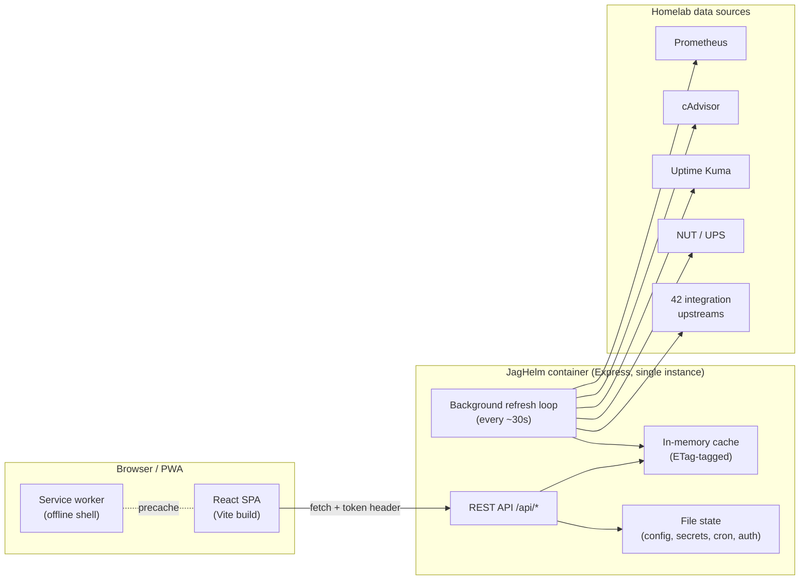
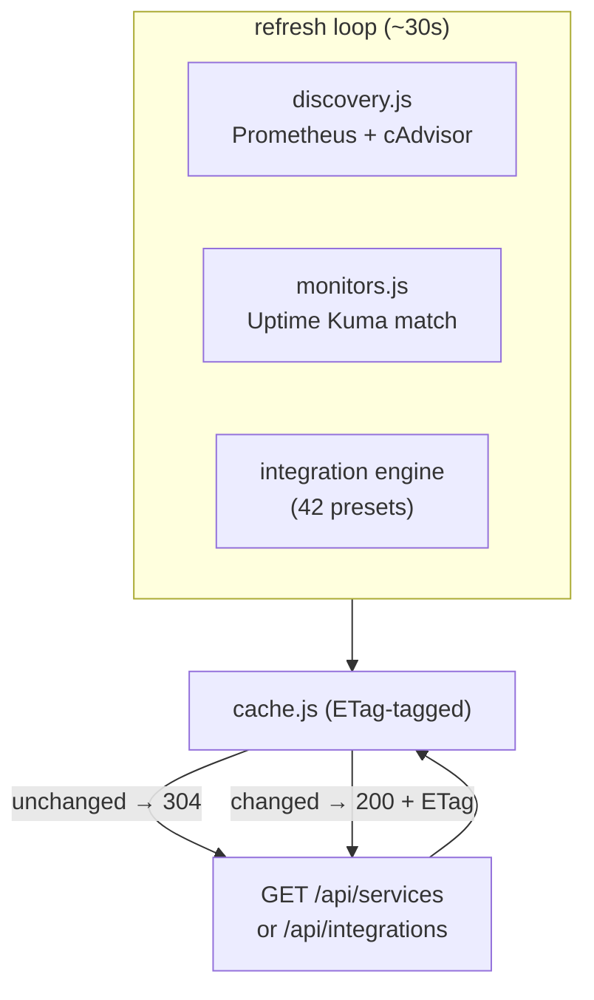
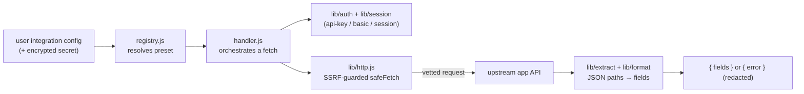
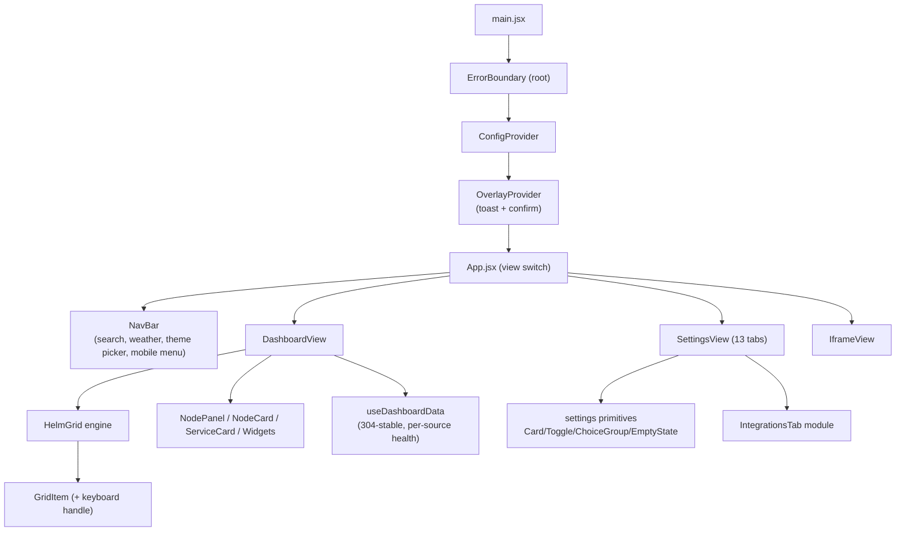
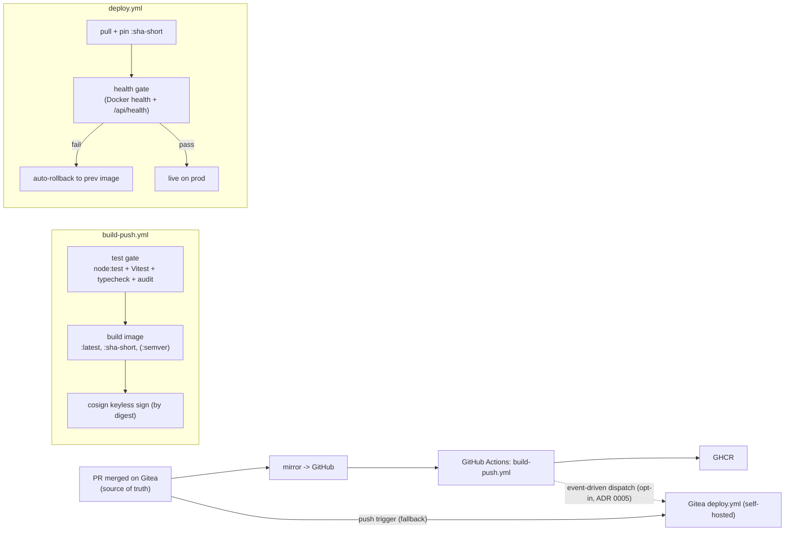

# JagHelm — Architecture

JagHelm is a self-hosted homelab dashboard whose differentiator is **live data,
not just links**: it renders real Prometheus / cAdvisor metrics and pulls live
state from 42 service integrations, laid out on a custom drag-and-resize grid.
It is **single-user, single-instance, and file-backed** (no database), and ships
as a Docker image to a homelab.

> Reflects `main` as of v1.2.0. For *why* specific decisions were made, see the
> ADRs in [`docs/adr/`](adr/). For limitations and scope, see
> [`KNOWN-ISSUES.md`](../KNOWN-ISSUES.md). For the change history, see
> [`CHANGELOG.md`](../CHANGELOG.md).

## 1. Design philosophy

- **Live data over static links.** The point of difference vs Homepage/Dashy is
  that panels show *current* numbers (CPU, RAM, queue depth, block-rate) fetched
  server-side, not just bookmarks.
- **Single instance, in-memory, file-backed.** Sessions live in a `Map`, the
  refresh loop runs in-process, and all user state is a handful of files under a
  data dir. Simple to run; deliberately not horizontally scalable
  ([ADR 0002](adr/0002-in-memory-single-instance.md)).
- **Server does the talking.** The browser only ever calls JagHelm's own API; the
  server fans out to Prometheus, cAdvisor, Uptime Kuma, a NUT exporter, and the
  integration upstreams. Credentials never reach the client.
- **Safe by construction.** Outbound requests pass a single SSRF-guarded fetch
  chokepoint; secrets are encrypted at rest; writes are atomic; config is
  copy-on-read.

## 2. System topology



The browser talks **only** to `/api/*`. A background loop refreshes upstream data
on an interval into an in-memory cache, so API reads are fast and ETag-enabled
(304s on unchanged data). The deploy chain is separate — see §7.

## 3. Repository layout

```
server/                     Express API (Node 22, ESM)
  index.js                  app wiring: middleware chain + route mounts + SPA fallback
  refresh.js                background refresh loop (start/stop)
  cache.js                  bounded in-memory cache (FIFO, ETag tags)
  discovery.js              Prometheus/cAdvisor -> nodes + services
  monitors.js               Uptime Kuma monitor matching
  config.js                 display config: copy-on-read + atomic save
  secrets.js                AES-256-GCM secret store (per-install KDF salt)
  cron-store.js             cron history (bounded)
  errors.js                 apiError + global JSON error handler
  version.js                single source of version (reads package.json)
  metrics.js                prom-client registry + middleware + /metrics handler
  demo.js                   DEMO_MODE read-only sample dashboard
  auth/                     scrypt passwords, in-memory sessions, login rate limit, middleware
  routes/                   one router per resource (see 4.1)
  integrations/             the integration engine (presets + handler + lib, see 4.3)
  util/                     logger, ssrf, redact, rateLimiter, atomicWrite,
                            configSchema (zod), dataDir, asyncHandler, dedupe

src/                        React 19 SPA (Vite 8)
  main.jsx, App.jsx         providers (Config, Overlay) + ErrorBoundary + view switch
  api/client.js             apiFetch -- explicit auth-injecting fetch wrapper
  context/                  ConfigContext (config + update via setIn), OverlayContext (toast/confirm)
  hooks/useData.js          fetchJson (304-aware), weather, search engines
  utils/setIn.js            immutable structural-sharing deep-set
  components/HelmGrid/       custom grid engine (gridMath, GridItem, HelmGrid)
  components/settings/       shared primitives + 13 settings tabs (+ IntegrationsTab module)
  components/                NodeCard, ServiceCard, Widgets, NavBar, overlays, etc.
  views/DashboardView/       grid + panels + useDashboardData (304-stable) + per-source health
  views/SettingsView.jsx     13-tab settings shell + collapsible live preview
  styles/global.css          themes (10) + design tokens + component styles

public/sw.js                service worker (precache injected at build)
scripts/                    inject-sw-precache.mjs, check-assets.mjs (build/CI helpers)
.github/workflows/          build-push.yml (build -> sign -> GHCR)
.gitea/workflows/           deploy.yml (pin -> health-gate -> rollback)
docs/adr/                   architecture decision records (0001-0005)
```

## 4. Backend architecture

### 4.1 Express server & middleware chain

`server/index.js` wires the app in order: Prometheus metrics middleware -> request
logger -> Helmet security headers + **Content-Security-Policy (report-only)** ->
CORS -> `express.json({ limit: '1mb' })` -> `/uploads` static -> `/metrics` ->
(optional `DEMO_MODE` middleware) -> the API routers -> hashed-asset static
(`immutable, 1y`) -> SPA fallback (`index.html`) -> the global JSON error handler.

Routers (each `server/routes/*.js`), mounted under `/api`:

| Mount | Auth | Purpose |
|-------|------|---------|
| `/api/auth` | public | login, logout, auth-status |
| `/api/health`, `/api/readyz` | public | liveness / readiness probes |
| `/metrics` | public | Prometheus exposition |
| `/api/services` | token | discovered nodes + services (background-refreshed, ETag) |
| `/api/integrations` | token | per-integration live data (background-refreshed, ETag) |
| `/api/display-config` | token | the display config blob |
| `/api/secrets` | token + **auth-required** | encrypted credential store (fail-closed) |
| `/api/cron`, `/api/todos`, `/api/upload`, `/api/icons` | token | widgets + asset upload |
| `/api/...` (infrastructure) | token | Prometheus query proxy, UPS, etc. |

Auth is a **header token**, not a cookie (so permissive CORS is not a CSRF
vector). `/api/secrets` additionally goes through `requireAuthEnabled` -- it
returns 403 when no password is set, so an open instance can't enumerate
credentials ([KNOWN-ISSUES](../KNOWN-ISSUES.md) covers the open-by-default model).

### 4.2 Background refresh & cache

`refresh.js` runs a single in-process interval that re-fetches node/service
metrics and every configured integration into the bounded `cache.js`
(FIFO-evicted, max entries, so user-influenced keys can't exhaust memory). API
reads serve from the cache and attach an ETag; an unchanged poll returns `304`.
The loop is cancelled cleanly on shutdown (no leaking timer).



### 4.3 Integration engine

The differentiator. A declarative **preset** (`integrations/presets/*.js`, 42 of
them) describes how to talk to one app: endpoints, auth mode, and which JSON
paths map to which display fields. The flow:



Key properties:

- **One guarded chokepoint.** Every outbound request goes through
  `lib/http.js` `safeFetch`, which calls `assertSafeUrl` (`util/ssrf.js`) by
  construction -- blocking cloud-metadata IPs, decimal/hex/octal IPv4, and
  IPv4-mapped IPv6, with a `trusted` flag exempting operator infra (Prometheus/
  Kuma) from the strict private-network block.
- **Credentials are redacted** (`util/redact.js`) before any error is logged *or*
  returned to the browser -- query-auth presets put the key in the URL, which
  fetch errors would otherwise echo.
- **Session-auth presets** (e.g. Proxmox) get a managed login session via
  `lib/session.js`; the same SSRF guard still applies.

### 4.4 Config, secrets, and persistence

- **Display config** (`config.js`) is **copy-on-read** (`getConfig()` returns a
  `structuredClone`) and saved via a synchronous **atomic** write
  (temp -> fsync -> rename), so a route can't mutate shared state and a crash
  can't truncate the file ([ADR 0001](adr/0001-atomic-file-writes.md),
  [ADR 0004](adr/0004-config-copy-on-read.md)). It is validated against a Zod
  schema (`util/configSchema.js`) on read, so a malformed file fails loudly.
- **Secrets** (`secrets.js`) are AES-256-GCM encrypted with a **per-install
  random KDF salt** (`data/.secrets-salt`, legacy-static-salt fallback). All
  credential stores write `0600`.
- **Data dir** is single-sourced via `util/dataDir.js` (`JAGHELM_DATA_DIR`) so
  secrets/auth/config/cron never split across locations.

### 4.5 Auth & rate limiting

scrypt password hashing (`auth/passwords.js`), in-memory sessions
(`auth/sessions.js`), and a brute-force **login rate limiter** (`auth/rateLimit.js`).
A reusable `util/rateLimiter.js` additionally throttles the abuse-prone
integration connection-test endpoint.

### 4.6 Observability

- **Structured logging** (`util/logger.js`) with redaction -- no secrets in logs.
- **Prometheus metrics** at `/metrics` via `prom-client` (`metrics.js`): request
  rate, latency histograms, refresh-loop health.
- **Two probes**: `/api/health` (liveness; reflects refresh-loop liveness -- 503
  when wedged) and `/api/readyz` (readiness; distinguishes "not ready yet" from
  "down"), backing the Docker `HEALTHCHECK` and the deploy gate.

## 5. Frontend architecture



- **State.** `ConfigContext` exposes `config`, the stable `setConfig`, and a
  memoised `update(path, value)` built on `setIn` (immutable structural-sharing
  deep-set) -- so leaf cards memoise and don't re-render on unrelated edits.
  `OverlayContext` provides `useToast` / `useConfirm` (focus-trapped, Escape,
  focus-restore, reduced-motion). `api/client.js` `apiFetch` injects the auth
  token explicitly (replacing an old `window.fetch` monkey-patch).
- **HelmGrid** is a custom, dependency-light layout engine: pure math in
  `gridMath.js` (snap, overlap-resolve, content-fit), per-item measurement +
  rendering in `GridItem.jsx`, and lifecycle (breakpoints, drag/resize, commit)
  in `HelmGrid.jsx`. Panels auto-grow to fit content; pointer **and keyboard**
  (arrow move / Shift+arrow resize, with a live region) reposition them.
- **Data fetching.** `useDashboardData` holds a **304-stable identity contract**:
  on an unchanged poll `fetchJson` returns the same reference and `setState`
  bails via `Object.is`, so an all-304 tick triggers zero re-renders. Per-source
  health (error / stale / retry) is derived at render without per-tick state.
- **Design system.** 10 themes (`themes.js` + `[data-theme]` token blocks),
  generic `--space-*` / `--text-*` scales plus semantic `--fs-*` card tokens,
  and a global `:focus-visible` ring + reduced-motion handling.
- **PWA.** `public/sw.js` precaches the app shell **and** the hashed first-paint
  bundles (the precache list + version are injected at build by
  `scripts/inject-sw-precache.mjs`); immutable `/assets/` are served cache-first.

## 6. Data model

All state is files under the data dir (no DB):

- **display config** -- title, theme, layout (`{lg,md,sm}` grid item arrays),
  sections (per-panel visibility/order/colour), nav/search/weather flags,
  integration configs (the secret value stored separately, encrypted), links,
  fonts. Read copy-on-read; validated by Zod.
- **secrets** -- AES-256-GCM blob, keyed by integration storage key.
- **cron history**, **todos**, **auth** (password hash + salt) -- small files,
  atomic writes.

## 7. CI/CD pipeline



- **Build** ([build-push.yml](../.github/workflows/build-push.yml)) runs on
  GitHub: a test gate (so a red `main` can't ship), then build with immutable
  `:sha-<short>` tags + OCI provenance labels, then **keyless cosign signing**.
- **Deploy** ([deploy.yml](../.gitea/workflows/deploy.yml)) runs on the
  self-hosted Gitea runner: pull and **pin this commit's `:sha-<short>`** image,
  recreate behind a **health gate** that auto-rolls-back to the previous image on
  failure.
- **Event-driven trigger** ([ADR 0005](adr/0005-event-driven-deploy.md)): the
  build dispatches the deploy when the image is ready, replacing a GHCR poll. It
  is opt-in and fallback-preserving -- the push trigger remains until verified.

## 8. Testing

220 automated tests gate the build:

- **Backend** (136, `node --test`): the AES-GCM secrets round-trip + tamper, the
  SSRF guard vectors, credential redaction, the upload allowlist, config
  schema/copy-on-read (incl. a `SIGKILL`-mid-write chaos test), route contracts,
  rate limiting, `/health` + `/readyz`, and the pure HelmGrid `gridMath` +
  service-worker precache injector.
- **Client** (84, Vitest + jsdom + React Testing Library): NavBar/config-driven
  rendering, settings primitives, the keyboard grid handle, per-source health
  banners, overlay/confirm semantics, and the 304-stable data hook.

## 9. Key decisions (ADRs)

| ADR | Decision |
|-----|----------|
| [0001](adr/0001-atomic-file-writes.md) | Atomic temp->fsync->rename writes for all user state |
| [0002](adr/0002-in-memory-single-instance.md) | Single-instance, in-memory state (no DB) |
| [0003](adr/0003-scoped-tls-bypass.md) | Per-request, opt-in TLS-verify bypass for self-signed infra |
| [0004](adr/0004-config-copy-on-read.md) | Config is copy-on-read + synchronous atomic writes |
| [0005](adr/0005-event-driven-deploy.md) | Event-driven build->deploy trigger (opt-in, fallback-preserving) |

## 10. Known tradeoffs

Single-instance / in-memory (no clustering), single-user / single-tenant, and a
hard Prometheus dependency for node metrics are **deliberate scope choices**, not
bugs. The full list -- security defaults (open-by-default, host networking),
integration drift, and roadmap items -- lives in
[`KNOWN-ISSUES.md`](../KNOWN-ISSUES.md).
